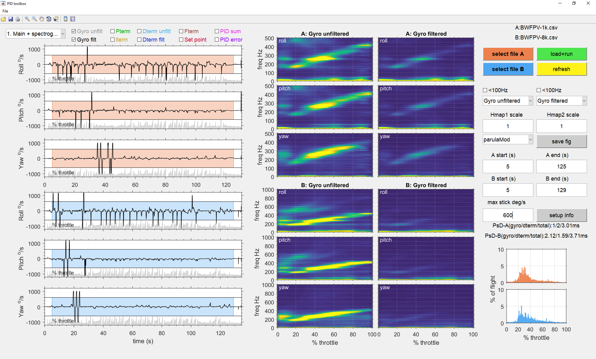
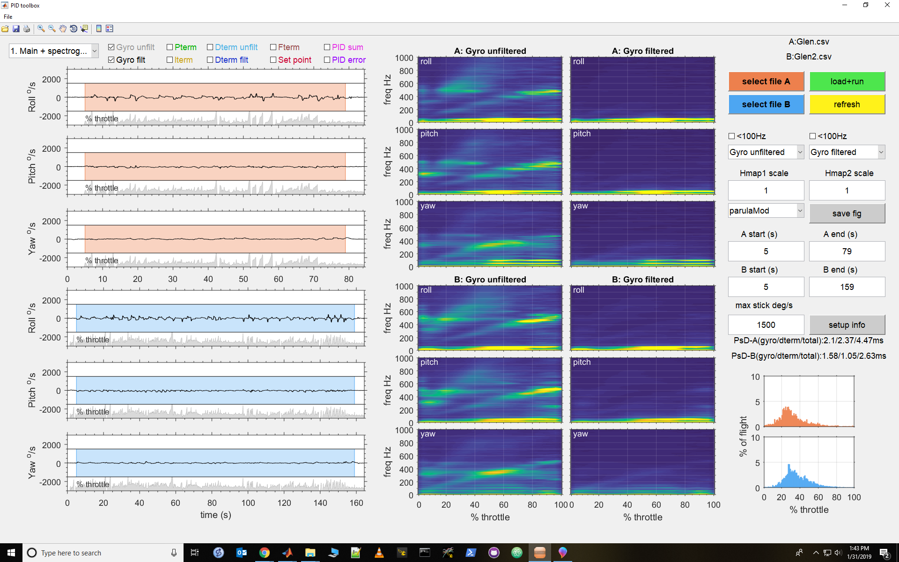
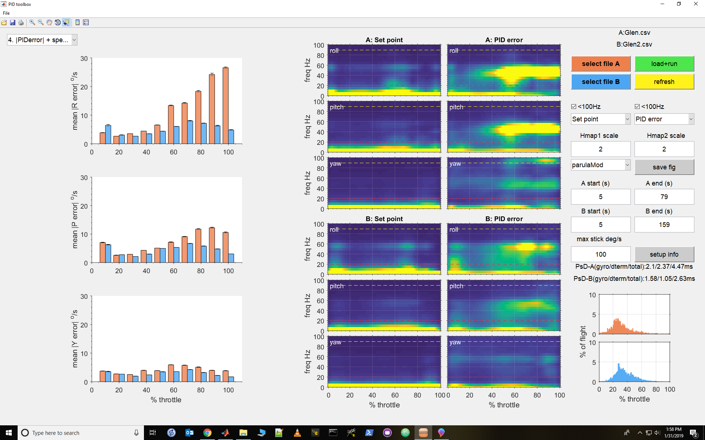
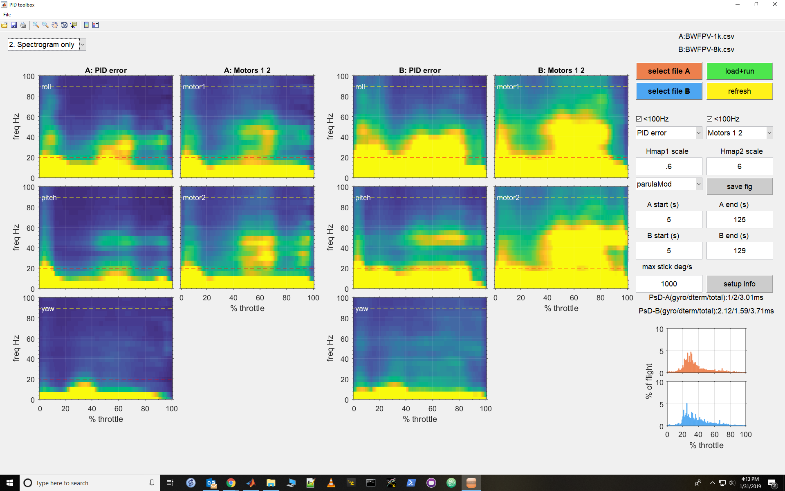

# PIDtoolbox

PIDtoolbox is a Matlab-based GUI for analyzing Betaflight blackbox log files for multirotors.

The motivation for the development of this tool was to create a user-friendly GUI for analyzing blackbox data, as well as an objective method for comparing between flights. It was inspired by the way we often troubleshoot flight performance issues (e.g., vibrations, mid-throttle oscillation, propwash), where we make back to back test flights with slight changes in the software/hardware/mechanical setup with each test, and then make subjective inferences about flight performance. The problem is subjective bias becomes a real issue when the differences between tests are subtle. PIDtoolbox was designed with this in mind.

PIDtoolbox is also devoted more to spectral analysis than tuning per se, since filtering out vibration seems to be the number one concern. A major part of flight control software development has been devoted to filtering noise from the gyro, particularly in the ~200-500Hz range associated with motor vibration. In my own analyses of blackbox data, I've noticed a consistent pattern between copters that fly well and copters that do not, specifically in the 30-90Hz range. Commanded motion is generally below ~20Hz (even if you're a 'Mr. Steele' on the sticks!), and from my observations, elevated activity in the 30-90Hz range tends to correlate with the kind of vibrations we SEE during flight and in HD video (e.g., mid-throttle oscillation, propwash, jello). Although these frequencies can't be filtered out, one goal of PIDtoolbox was to use this as an objective measure of flight performance, to help the user decide whether a manipulation of software/hardware/mechanical setup was effective. I'll show some examples that support this idea. That said, the goal of a well-performing copter still involves reducing +100Hz noise, and PIDtoolbox maintains the ability to plot the full throttle x freq spectrograms that we've come to love about Plasmatree PID-analyzer. I have a hunch, however, that the way any vibration manifests in FPV/HD video feed is through this ~30-90Hz band, and remember, FPV/HD video feed is still the main way we experience AND evaluate flight performance; if we never saw vibrations in the video feed, no one would be complaining.

A little disclaimer, what I know about control theory is limited to my 3-4 year experience with multirotors. So for engineer types, some aspects of PIDtoolbox might seem unconventional, and I welcome your feedback. I do research on the <a href="https://sites.google.com/site/bjw112968/" target="blank">neural control of eye movements</a>, which interestingly has a lot of similarities to the flight characteristics and blackbox data of multirotors. PIDtoolbox was also inspired by Plasmatree PID-analyzer (https://github.com/Plasmatree/PID-Analyzer), and one of the goals was to extend that type of functionality here in a GUI-based program.

Below is everything you need to begin using PIDtoolbox. I hope you find it useful, and I welcome feedback from the FPV community.

-Brian

# Download

There are a couple of ways you can download PIDtoolbox. 

**1)** If you have Matlab, you can simply download the repository of mfiles, place them in a folder, and run PIDtoolbox.m from the Matlab command prompt. You will need Signal Processing Toolbox installed for this to work.

**2)** If you do not have Matlab, you can download a standalone Windows version of PIDtoolbox. You must first install Matlab runtime (MATLAB® Compiler Runtime, MCR), which then allows you to run any standalone Matlab program.

**Steps:**

**(i)** Install Matlab runtime <a href="https://www.mathworks.com/products/compiler/matlab-runtime.html" target="blank">(Matlab-runtime)</a> for Windows (64bit only, version 9.3 R2017b). Unfortunately, it will likely not work for Windows 32bit users. I have not tested this across multiple versions of Windows, so your feedback here will be very helpful. I will continue to provide updates in this regard so stay tuned. The good news is this is a one-time installation, after which you can run any Matlab standalone!

**(ii)** Download PIDtoolbox for Windows here:
<a href="https://github.com/bw1129/PIDtoolbox/releases" target="blank">(releases)</a> Unzip and place entire folder in a preferred location on your computer. PIDtoolbox.exe can be found in 'PIDtoolbox\for_redistribution_files_only\PIDtoolbox.exe'. NOTE, PIDtoolbox.exe and other files MUST remain in this folder, so I'd recommend creating a shortcut and placing it on your desktop. For Mac/Linux users, if you have a bonafide copy of Matlab and can create your own standalone version of PIDtoolbox, it'd be greatly appreciated if you could share it here!

If you have issues installing Matlab runtime, or running PIDtoolbox, please give feedback here:
<a href="https://github.com/bw1129/PIDtoolbox/issues" target="blank">(issues)</a>
or drop a post to the Betaflight BlackBox Log Review Facebook group: <a href="https://www.facebook.com/groups/291745494678694/?ref=bookmarks" target="blank">(Betaflight BlackBox Log Review Facebook group)</a>

# How to use

PIDtoolbox will support .bbl, .bfl, or .csv files, but there are a few things you need to know: 

**(i)** If you wish to use .bbl or .bfl files directly, you will need to have a copy of 'blackbox_decode.exe' in the same directory as your .bbl/.bfl files. 'blackbox_decode.exe' is part of Betaflight/cleanflight blackbox-tools, and can be downloaded here:
<a href="https://www.github.com/betaflight/blackbox-tools" target="blank">(Betaflight Blackbox-tools)</a>

**(ii)** My recommendation is use .csv files. BUT NOTE, you MUST convert your .bbl or .bfl file to a .csv file using Betaflight Blackbox-log-viewer. Save as .csv from there please! Betaflight Blackbox-log-viewer can be downloaded here: 
<a href="https://www.github.com/betaflight/blackbox-log-viewer/releases" target="blank">(Betaflight Blackbox-log-viewer)</a>

**(iii)** I would recommend always logging at 2k (unless you're running 1k loop rate in which case log at 1k), because the spectrograms only go to 1k. From my experience, I have had some really large log files crash when trying to convert to .csv in Betaflight Blackbox-log-viewer. In addition, PIDtoolbox will run much faster with 2k files. For 32k mode users, I don't know what to say ;-)

If you have issues installing Matlab runtime, or running PIDtoolbox, please give feedback here:
<a href="https://github.com/bw1129/PIDtoolbox/issues" target="blank">(issues)</a>
or drop a post to the Betaflight BlackBox Log Review Facebook group: <a href="https://www.facebook.com/groups/291745494678694/?ref=bookmarks" target="blank">(Betaflight BlackBox Log Review Facebook group)</a>

Now, let's get on with a few examples:

### E.G. (i) Mid-throttle oscillation
'Glen' posted a log file (A) to the Betaflight BlackBox Log Review Facebook group: <a href="https://www.facebook.com/groups/291745494678694/?ref=bookmarks" target="blank">(Betaflight BlackBox Log Review Facebook group)</a>
describing a vibration issue with his copter. He then made some changes to the PIDs and filters and reposted a second log file (B). I imported each log file using the 'select' buttons, then clicked 'load+run'. Below is a screenshot of the main results, with line plots of flight data on the left (gyro filtered and unfiltered lines selected), and spectrograms on the right. Notice that Test A and Test B are coded as orange vs blue, respectively, and the orange/blue shaded regions indicate the window of the data used for subsequent analysis (which can be adjusted from the control panel on the far right). Also, if you click within the white region of any of the line plots, it expands to facilitate viewing and control with the zoom tools. From this data, it looks like the post filtered Gyros (right panels) are clean in both test flights A (upper) and B (lower). 

Using the drop down menus in the control panel, I then selected the specrograms to compute sub-100Hz throttle x freq plots for set point and PID error, then hit 'refresh' (see below). I know, you're thinking "why are you plotting set point?" Since set point is RC input in deg/s, the freq spectrum of set point is a good measure of the range of frequencies associated with commanded motion. Theoretically, anything above this is uncommanded motion (i.e., stuff we don't like, such as mid-throttle oscillations, propwash, etc.). The horizontal dashed lines on the spectrograms delineate this region (which, incedentally corresponds with the cutoff used in UAVtech's <a href="https://drive.google.com/drive/folders/1jCIJ2FKL7t-ZADcErNrZOcWfWtkgSVdr" target="blank">filter calc tool</a>. Now, when we look at the spectrogram of PID error (right panels), we see a clear band of activity around 40-50Hz in the mid-to-upper throttle range, mainly on roll and pitch for test A, and less so for test B (despite the fact that the full spectrum looked clean for both!). To corroborate this, we can see clear oscillations in the Gyro and PID error traces blown up on the left, with peaks ~22ms apart (which is 45Hz!). Remember, this was not obvious when viewing the full spectrum.

To go a little further, we can plot the mean absolute value of PID error as a function of throttle (see below). For these plots, we window the analysis to flight data where RC input was less than 100deg/s (see max stick window in the control panel), to minimize the influence of large error associated with fast flips/rolls (fortunately, snap flips/rolls usually occur at min throttle, so it's actually not a major issue here). You can see a systematic increase in mean |PID error| starting around mid-throttle, particularly for roll in test A (orange bars), and mirroring the earlier spectrogram data. From these results, it's clear that the adjustments made in test B were an improvement from test A. We're on the right track! 

### E.G. (ii) Propwash
This past summer I was asked by Mark Spatz <a href="https://www.youtube.com/channel/UCI2MZOaHJFMAmW5ni7vuAQg" target="blank">(UAVtech)</a> to compare propwash handling between 1k and 8k pid loop rates, on the same copter with identical settings with the exception that the 1k setup did not have the dynamic notch active. Thus, the 1k setup had a minor disadvantage in terms of potentially more motor-related noise (see fig at the beginning of this document), but also an advantage of having slightly lower total phase latency (3.01ms vs 3.71ms for A vs B, respectively, abbreviated as PsD-A and PsD-B in the lower portion of the control panel; note, phase latency is computed directly in PIDtoolbox via cross correlation between filtered and unfiltered gyro and dterm). I posted an HD video <a href="https://www.youtube.com/watch?v=Tbx--JI01NE" target="blank">(Propwash Video Test)</a> of both flights on the Rotor Riot Facebook page, and then polled observers to decide which one showed less propwash in a blind test. Turns out people chose test (1). See if you can guess which one that corresponds to in the following results of both flights:

In this case we are plotting the spectrograms only (Test A left and Test B right) for sub-100Hz PID error and motor sigs 1 and 2. Test A shows less activity in the 20-90Hz window in both PID error and the motor 1-2 signals (the same was true for motors 3-4, not plotted here). For test B, there is a bigger 'blob' of activity above the red 'commanded motion' line, indicative of more vibration/propwash. Incidentally, it turns out that flight (1) in the video corresponds to Test A here. It's also worth noting that these spectrograms are normalized such that the amplitude spectrum is unaffected by the length of the file/flight, which makes it more of an apples-to-apples comparison. This result shows the novelty and value of being able to plot spectrograms across different kinds of blackbox data. PIDtoolbox gives you the option to plot spectrograms for several other variables, as well as change the scale and select from a list of color maps.

I hope you find PIDtoolbox useful, and I welcome feedback from the FPV community.

Cheers! -Brian

