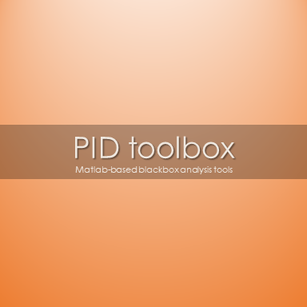

# PIDtoolbox

PIDtoolbox is a GUI-based Matlab tool for analyzing Betaflight blackbox log files. 

The motivation behind the development of this tool was to create a user-friendly, objective, method for comparing between flights. This came after a realization of the way we often troubleshoot an issue with flight performance (e.g., vibrations, mid-throttle oscillation, propwash oscillation, etc). A typical scenario goes something like "run test flight 'A', make subjective assessment of performance, tweek parameters, run test flight 'B', make subjective comparison between A and B, re-tweek", and so on. The problem with this approach from a scientific standpoint is that it lacks objectivity and reliability. Subjective bias becomes particularly problematic when the differences between A and B are subtle. PIDtoolbox was designed with this in mind.

I am not an engineer, and what I know about control theory has only come from my experience with miniquads over that past 3-4 years. So for engineer types out there, PIDtoolbox may seem like a slightly unconventional approach to PID analysis. That said, I am a Neuroscientist with about ~15ys experience and publishing on the neural basis of oculomotor control, which believe it or not has a close resemblance to the flight characteristics of miniquads. I also study neuronal oscillations, hence the focus on spectrograms. PIDtoolbox was partly inspired by Plasmatree PID-analyzer (https://github.com/Plasmatree/PID-Analyzer), and the goal was to extend some of that functionality in a GUI-based program.

Over the past year or so, there has been increasing emphasis on advanced gyro and dterm filtering, particularly in the +150Hz range, and this has led to amazing improvments in flight characteristics. During that time I have been analyzing many blackbox log files in Matlab and noticed a consistent difference between copters that fly well and copters that do not, specifically in the 30-100Hz spectrum, which can often be seen in |PID error| during steadly-state flight. Most commanded copter motion is below ~20Hz (even if you're a Mr. Steele on the sticks, at best you might push this to 25-30Hz!), but from my analyses, activity between 30-100Hz tends to correlate with the kind of vibes we SEE during flight and in HD vide (things like mid-throttle oscillation, propwash, video jello, etc.). Although these frequencies cannot be filtered out, the goal of PIDtoolbox is to use it as an objective comparative index between A/B testing to help decide whether the changes between A-B tests (in software settings, hardware, mechanical, or otherwise) were effective. 

That said, below is everything you need to begin using PIDtoolbox. I hope you find it useful, and I would really appreciate feedback from the FPV community.

Cheers! -Brian White

# Download and run PIDtoolbox
